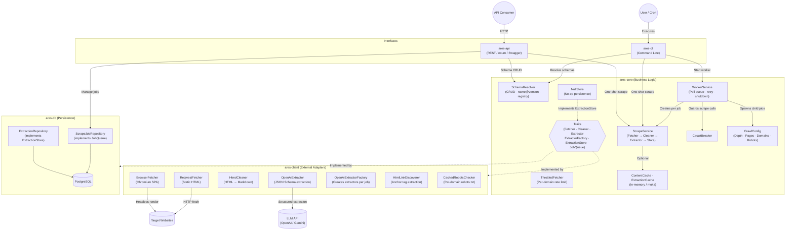

<p align="center">
  
</p>

<h1 align="center">Ares</h1>

<p align="center">
  Web scraper with LLM-powered structured data extraction.
</p>

<p align="center">
  <a href="https://crates.io/crates/ares-core"></a>
  <a href="https://github.com/AndreaBozzo/Ares/actions/workflows/ci.yml"></a>
  <a href="https://discord.gg/fztdKSPXSz"></a>
</p>

---

Ares fetches web pages, converts HTML to Markdown, and uses LLM APIs to extract structured data defined by JSON Schemas. It exposes both a CLI and a REST API, supports persistent job queues with retries, circuit breaking, rate-limiting, change detection, and graceful shutdown.

> *Named after the Greek god of war and courage.*

Conceptual sibling of [Ceres](https://github.com/AndreaBozzo/Ceres) — same philosophy, different temperament. Where Ceres is the nurturing goddess of harvest, Ares charges headfirst into the web and *takes* what it needs.

> 💡 **Claude Code user?** Install the [Ares Claude Skill](https://github.com/AndreaBozzo/Ares-Claude-Skill) to give Claude deep knowledge of Ares — architecture, traits, CLI, REST API, schemas, and extension patterns.


## Architecture



```
ares-cli          CLI interface — arg parsing, wiring, output formatting, delegation
ares-api          REST API — Axum HTTP server, OpenAPI/Swagger UI, Bearer auth
ares-core         Business logic — ScrapeService, WorkerService, CircuitBreaker, CrawlConfig, ContentCache, ExtractionCache, SchemaResolver, traits
ares-client       External adapters — ReqwestFetcher, BrowserFetcher, HtmdCleaner, OpenAiExtractor, HtmlLinkDiscoverer, CachedRobotsChecker
ares-db           PostgreSQL persistence — ExtractionRepository, ScrapeJobRepository, migrations
```

All external dependencies are behind traits (`Fetcher`, `Cleaner`, `Extractor`, `ExtractionStore`, `ExtractorFactory`, `JobQueue`), enabling full mock-based testing. The `Fetcher` trait has two implementations: `ReqwestFetcher` for static pages and `BrowserFetcher` (feature-gated behind `browser`) for JS-rendered SPAs.

## Prerequisites

- **Rust** 1.88+ (edition 2024)
- **Docker** (for PostgreSQL and integration tests)
- An **OpenAI-compatible API key** (OpenAI, Gemini, or any compatible endpoint)
- **Chromium / Chrome** (only when using `--browser` for JS-rendered pages)

## Quick Start

```bash
# Clone and build
git clone <repo-url> && cd Ares
cargo build

# Start PostgreSQL
docker compose up -d

# Configure environment
cp .env.example .env
# Edit .env with your API key and settings

# One-shot scrape (stdout only)
cargo run -- scrape -u https://example.com -s schemas/blog/1.0.0.json

# Scrape a JS-rendered page with headless browser
cargo run --features browser -- scrape -u https://spa-example.com -s blog@latest --browser

# Scrape and persist to database
cargo run -- scrape -u https://example.com -s blog@latest --save

# View extraction history
cargo run -- history -u https://example.com -s blog

# Create a background job
cargo run -- job create -u https://example.com -s blog@latest

# Start a worker to process jobs
cargo run -- worker
```

## CLI Commands

### `ares scrape`

One-shot extraction. Fetches the URL, cleans HTML to Markdown, sends it to the LLM with the JSON Schema, and prints the extracted data to stdout.

| Flag | Env Var | Description |
|---|---|---|
| `-u, --url` | | Target URL |
| `-s, --schema` | | Schema path or `name@version` |
| `-m, --model` | `ARES_MODEL` | LLM model (e.g., `gpt-4o-mini`) |
| `-b, --base-url` | `ARES_BASE_URL` | API base URL (default: OpenAI) |
| `-a, --api-key` | `ARES_API_KEY` | API key |
| `--save` | | Persist result to database |
| `--schema-name` | | Override schema name for storage |
| `--browser` | | Use headless browser for JS-rendered pages (requires `browser` feature) |
| `--fetch-timeout` | | HTTP fetch timeout in seconds (default: 30) |
| `--llm-timeout` | | LLM API timeout in seconds (default: 120) |
| `--system-prompt` | | Custom system prompt for LLM extraction |
| `--skip-unchanged` | | Skip saving when extracted data hasn't changed (requires `--save`) |
| `--throttle` | | Per-domain throttle delay in milliseconds (e.g., 1000 for 1s between requests) |
| `--no-cache` | | Disable in-memory caching (content + extraction) |
| `--cache-ttl` | `ARES_CACHE_TTL` | Cache TTL in seconds (default: 3600) |
| `--format` | | Output format: `json`, `jsonl`, `csv`, `table`, `jq` (default: `json`) |

### `ares history`

Show extraction history for a URL + schema pair, with change detection.

| Flag | Env Var | Description |
|---|---|---|
| `-u, --url` | | Target URL |
| `-s, --schema-name` | | Schema name to filter by |
| `-l, --limit` | | Number of results (default: 10) |
| `--format` | | Output format: `json`, `jsonl`, `csv`, `table`, `jq` (default: `json`) |

### `ares job create|list|show|cancel`

Manage persistent scrape jobs in the PostgreSQL queue.

### `ares worker`

Start a background worker that polls the job queue, processes scrape jobs through the circuit breaker, handles retries with exponential backoff, and supports graceful shutdown via Ctrl+C.

| Flag | Env Var | Description |
|---|---|---|
| `--worker-id` | | Custom worker ID (auto-generated if omitted) |
| `--poll-interval` | | Seconds between job queue polls (default: 5) |
| `-a, --api-key` | `ARES_API_KEY` | API key |
| `--browser` | | Use headless browser for JS-rendered pages (requires `browser` feature) |
| `--fetch-timeout` | | HTTP fetch timeout in seconds (default: 30) |
| `--llm-timeout` | | LLM API timeout in seconds (default: 120) |
| `--system-prompt` | | Custom system prompt for LLM extraction |
| `--skip-unchanged` | | Skip saving when extracted data hasn't changed |
| `--throttle` | | Per-domain throttle delay in milliseconds |
| `--no-cache` | | Disable in-memory caching |
| `--cache-ttl` | `ARES_CACHE_TTL` | Cache TTL in seconds (default: 3600) |

### `ares crawl start|status|results`

Recursive web crawling with link discovery and robots.txt compliance. The seed URL is fetched, links are discovered, and child jobs are created in the queue for the worker to process.

| Flag | Description |
|---|---|
| `-u, --url` | Seed URL to start crawling from |
| `-s, --schema` | Schema path or `name@version` |
| `-d, --max-depth` | Maximum crawl depth (default: 1) |
| `-m, --model` | LLM model |
| `-b, --base-url` | API base URL |
| `--max-pages` | Maximum number of pages to crawl (default: 100) |
| `--allowed-domains` | Comma-separated allowed domains (defaults to seed URL domain) |
| `--schema-name` | Override schema name |

```bash
# Start a crawl (creates seed job + discovers links)
ares crawl start -u https://example.com -s blog@latest --max-depth 2 --max-pages 10

# Check progress (requires a worker running in another terminal)
ares crawl status <SESSION_ID>

# View extracted data from all crawled pages
ares crawl results <SESSION_ID>
```

### `ares schema validate`

Validate a JSON Schema file against the JSON Schema specification.

```bash
ares schema validate schemas/blog/1.0.0.json
```

## REST API

Ares ships a standalone HTTP server (`ares-api`) built on [Axum](https://github.com/tokio-rs/axum) with auto-generated [OpenAPI](https://swagger.io/specification/) documentation.

### Running the server

```bash
# Run locally
cargo run --bin ares-api

# Or with Docker
docker build -t ares-api:latest .
docker run -p 3000:3000 --env-file .env ares-api:latest
```

Once running, interactive API docs are available at **`/swagger-ui`**.

### Endpoints

| Method | Path | Auth | Description |
|---|---|---|---|
| `POST` | `/v1/scrape` | Bearer | One-shot scrape and extract |
| `POST` | `/v1/jobs` | Bearer | Create a scrape job |
| `GET` | `/v1/jobs` | Bearer | List jobs (filter by status, limit) |
| `GET` | `/v1/jobs/{id}` | Bearer | Get job details |
| `DELETE` | `/v1/jobs/{id}` | Bearer | Cancel a pending job |
| `GET` | `/v1/extractions` | Bearer | Query extraction history |
| `GET` | `/v1/schemas` | Bearer | List all schemas |
| `GET` | `/v1/schemas/{name}/{version}` | Bearer | Get schema definition |
| `POST` | `/v1/schemas` | Bearer | Create/upload a schema version |
| `PUT` | `/v1/schemas/{name}/{version}` | Bearer | Update a schema version |
| `DELETE` | `/v1/schemas/{name}/{version}` | Bearer | Delete a schema version |
| `POST` | `/v1/jobs/{id}/retry` | Bearer | Retry a failed/cancelled job |
| `POST` | `/v1/crawl` | Bearer | Start a crawl session |
| `GET` | `/v1/crawl/{id}` | Bearer | Get crawl session status |
| `GET` | `/v1/crawl/{id}/results` | Bearer | Get crawl session results |
| `GET` | `/health` | — | Health check (database connectivity) |

### Authentication

Protected endpoints require a `Bearer` token set via `ARES_ADMIN_TOKEN`. Token comparison uses constant-time equality (`subtle` crate) to prevent timing attacks.

```bash
curl -H "Authorization: Bearer $ARES_ADMIN_TOKEN" http://localhost:3000/v1/jobs
```

If `ARES_ADMIN_TOKEN` is not set, all protected endpoints return `403 Forbidden`.

## Schemas

Schemas are versioned JSON Schema files stored in `schemas/`:

```
schemas/
  registry.json
  blog/1.0.0.json            # Blog posts and articles
  github_repo/1.0.0.json     # GitHub repository pages
  product/1.0.0.json         # E-commerce product pages
  news_article/1.0.0.json    # News articles
  job_listing/1.0.0.json     # Job board listings
  recipe/1.0.0.json          # Recipe pages
  event/1.0.0.json           # Event listings
  dataset/1.0.0.json         # Open data portal datasets
```

Reference by path (`schemas/blog/1.0.0.json`) or by name (`blog@1.0.0`, `blog@latest`). Validate with `ares schema validate <path>`.

## Configuration

| Variable | Required | Default | Description |
|---|---|---|---|
| `ARES_API_KEY` | Yes | | LLM API key |
| `ARES_MODEL` | Yes | | LLM model name |
| `ARES_BASE_URL` | No | `https://api.openai.com/v1` | OpenAI-compatible endpoint |
| `DATABASE_URL` | For persistence | | PostgreSQL connection string |
| `DATABASE_MAX_CONNECTIONS` | No | `5` | PostgreSQL connection pool size |
| `ARES_ADMIN_TOKEN` | No | | Bearer token for REST API auth |
| `ARES_SERVER_PORT` | No | `3000` | HTTP server listen port |
| `ARES_SCHEMAS_DIR` | No | `schemas` | Path to schemas directory |
| `ARES_CORS_ORIGIN` | No | | Allowed CORS origins (comma-separated, or `*`) |
| `ARES_RATE_LIMIT_BURST` | No | `30` | Max burst requests per IP |
| `ARES_RATE_LIMIT_RPS` | No | `1` | Request replenish rate (per second) |
| `ARES_BODY_SIZE_LIMIT` | No | `2097152` | Max request body size in bytes (2 MB) |
| `ARES_CACHE_TTL` | No | `3600` | In-memory cache TTL in seconds |
| `CHROME_BIN` | No | Auto-detected | Override path to Chrome/Chromium binary |

**Gemini** works via the OpenAI-compatible endpoint:

```bash
export ARES_BASE_URL="https://generativelanguage.googleapis.com/v1beta/openai"
export ARES_MODEL="gemini-2.5-flash"
```

## Docker

```bash
# Build the image
docker build -t ares-api:latest .

# Run with docker compose (PostgreSQL + pgAdmin + server)
docker compose up -d
```

The Dockerfile uses a multi-stage build (Rust builder → Debian slim runtime) with Chromium pre-installed for browser-based scraping. The release binary is compiled with LTO and symbol stripping for minimal image size.

## Development

```bash
# Format, lint, and test
make all

# Run unit tests only
make test-unit

# Run integration tests (requires Docker)
make test-integration

# Run database migrations
make migrate

# Start/stop PostgreSQL
make docker-up
make docker-down
```

CI runs on every push and PR via GitHub Actions: formatting, Clippy, unit tests, integration tests (with a Postgres service container), and a `cargo-deny` security audit.

## License

[Apache-2.0](LICENSE)
